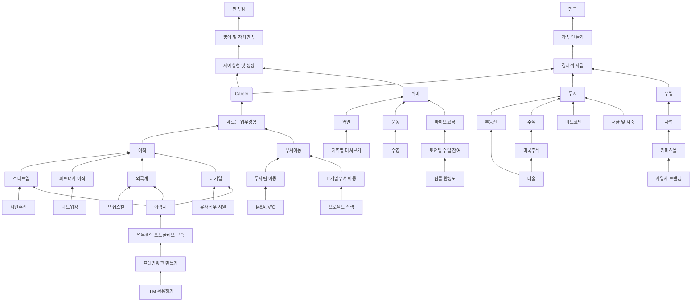

<h1 align="center">WHYTREE.md</h1>

---

### 1. 동근's Why Tree

```mermaid
graph TD
    %% 1. 노드 정의 (특수문자 방지를 위해 모두 큰따옴표 처리)
    TOP["행복하고 균형잡힌 삶"]
    
    V1["자아실현 (내적 성장/성취)"]
    V2["경제적 자유 (물질적 토대/안전)"]
    V3["사회적 공헌 (영향력/유산)"]
    V4["심신 건강 (지속성/평온)"]
    
    CAREER["Career (본업)"]
    SIDE["Side Hustle (부업)"]
    INVEST["Investment (재테크)"]
    HOBBY["Hobby (취미)"]
    
    C1["전문성 고도화"]
    C2["핵심 프로젝트 리딩"]
    C3["인적 네트워크 구축"]
    
    S2["서비스/플랫폼 구축"]
    S3["배달 알바"]
    
    I1["대체 투자"]
    I2["직접 투자"]

    C1_1["최신 기술 스택 습득 및 자격 취득"]
    C1_2["KAIST 석사 과정"]
    C2_1["사내 AI 경진대회 참가"]
    C2_2["임원 KPI PJT 리딩"]
    
    S2_1["숨고 쇼핑몰 구축 알바"]
    S2_2["바이브 코딩 활용 알바"]
    
    I1_1["부동산 직접 투자"]
    I1_2["채권, 자원펀드 등 투자"]
    I2_1["미국 주식"]
    I2_2["배당주 및 리츠 포트폴리오 구성"]

    H1["만들기"]
    H2["새로운 것 배우기"]
    H3["악기 연주"]
    H1_1["건담 조립"]
    H1_2["에어로 프라모델 만들기"]
    H2_1["일본어 배우기"]
    H3_1["피아노"]

    %% 2. 1:1 연결 관계 (순서를 조정하여 Hobby를 오른쪽으로 배치)
    TOP --- V1
    TOP --- V2
    TOP --- V3
    TOP --- V4
    
    %% Career 연결 (Idx: 4, 5, 6, 7)
    V1 --- CAREER
    V2 --- CAREER
    V3 --- CAREER
    V4 --- CAREER
    
    %% Side Hustle 연결 (Idx: 8, 9)
    V2 --- SIDE
    V3 --- SIDE
    
    %% Investment 연결 (Idx: 10, 11)
    V2 --- INVEST
    V4 --- INVEST

    %% Hobby 연결 (Idx: 12, 13)
    V1 --- HOBBY
    V4 --- HOBBY
    
    %% Career 하위 수단 (Idx: 14, 15, 16)
    CAREER --- C1
    CAREER --- C2
    CAREER --- C3
    
    SIDE --- S2
    SIDE --- S3
    
    INVEST --- I1
    INVEST --- I2

    C1 --- C1_1
    C1 --- C1_2
    C2 --- C2_1
    C2 --- C2_2
    S2 --- S2_1
    S2 --- S2_2
    I1 --- I1_1
    I1 --- I1_2
    I2 --- I2_1
    I2 --- I2_2

    %% 네트워크와 KAIST 과정 연결 (강조 없음)
    C3 --- C1_2

    %% 취미 상세 연결
    HOBBY --- H1
    HOBBY --- H2
    HOBBY --- H3
    H1 --- H1_1
    H1 --- H1_2
    H2 --- H2_1
    H2 --- C1_2
    H3 --- H3_1

    %% 3. 스타일링 (에러 방지를 위해 한글 주석 제거)
    style TOP fill:#F5F5F5,stroke:#D1D1D1
    style V1 fill:#FFF9F0,stroke:#FFECB3
    style V2 fill:#FFF9F0,stroke:#FFECB3
    style V3 fill:#FFF9F0,stroke:#FFECB3
    style V4 fill:#FFF9F0,stroke:#FFECB3
    style SIDE fill:#FAFAFA,stroke:#E0E0E0
    style INVEST fill:#FAFAFA,stroke:#E0E0E0
    style HOBBY fill:#FAFAFA,stroke:#E0E0E0
    
    style CAREER fill:#E8F5E9,stroke:#81C784,stroke-width:3px,color:#2E7D32

    %% 선 스타일 (4~7: 상단 가치->Career / 14~16: Career->하위수단)
    linkStyle 4,5,6,7,14,15,16 stroke:#A5D6A7,stroke-width:3px
```

---

### 2. 석빈's Why Tree



---

### 3. 지윤's Why Tree

```mermaid
graph TD
    TOP["Career or Next Step in Life"]

    V1["Stay"]
    V2["Change Companies"]
    V3["Change Jobs"]
    V4["Study More"]
    V5["Rest"]

    S1["Fulfillment"]
    S2["Emptiness"]
    S3["Need Growth"]
    S4["Work Life Balance"]

    C1["Korean Company"]
    C2["Global Company"]
    C3["Startup"]
    C4["Better Culture"]
    C5["Higher Compensation"]

    J1["Corporate Role"]
    J2["Creator or Influencer"]
    J3["Entrepreneur"]
    J4["Stay at Home Parent"]
    J5["Freelancer or Independent Work"]

    J2_1["Fashion or Beauty"]
    J2_2["Marriage"]
    J2_3["Food"]
    J2_4["Parenting or Baby"]
    J2_5["Travel"]
    J2_6["Lifestyle"]

    E1["Law School"]
    E2["PhD"]
    E3["MBA"]
    E4["Professional Certification"]
    E5["Skill Based Learning"]

    R1["World Travel"]
    R2["Meditation"]
    R3["Burnout Recovery"]
    R4["Health Reset"]
    R5["Time to Reflect"]

    W1["Meaning"]
    W2["Growth"]
    W3["Stability"]
    W4["Freedom"]
    W5["Authenticity"]

    FINAL["Meaningful Sustainable Authentic Life"]

    TOP --- V1
    TOP --- V2
    TOP --- V3
    TOP --- V4
    TOP --- V5

    V1 --- S1
    V1 --- S2
    V1 --- S3
    V1 --- S4

    V2 --- C1
    V2 --- C2
    V2 --- C3
    V2 --- C4
    V2 --- C5

    V3 --- J1
    V3 --- J2
    V3 --- J3
    V3 --- J4
    V3 --- J5

    J2 --- J2_1
    J2 --- J2_2
    J2 --- J2_3
    J2 --- J2_4
    J2 --- J2_5
    J2 --- J2_6

    V4 --- E1
    V4 --- E2
    V4 --- E3
    V4 --- E4
    V4 --- E5

    V5 --- R1
    V5 --- R2
    V5 --- R3
    V5 --- R4
    V5 --- R5

    S1 --- W1
    S2 --- W5
    S3 --- W2
    S4 --- W3

    C1 --- W3
    C2 --- W4
    C3 --- W2
    C4 --- W5
    C5 --- W3

    J1 --- W3
    J2 --- W5
    J3 --- W4
    J4 --- W1
    J5 --- W4

    E1 --- W2
    E2 --- W2
    E3 --- W3
    E4 --- W3
    E5 --- W2

    R1 --- W4
    R2 --- W1
    R3 --- W3
    R4 --- W3
    R5 --- W5

    W1 --- FINAL
    W2 --- FINAL
    W3 --- FINAL
    W4 --- FINAL
    W5 --- FINAL

    style TOP fill:#F5F5F5,stroke:#BDBDBD,stroke-width:2px
    style FINAL fill:#F5F5F5,stroke:#BDBDBD,stroke-width:2px

    style V1 fill:#E3F2FD,stroke:#64B5F6,stroke-width:2px
    style V2 fill:#E8F5E9,stroke:#81C784,stroke-width:2px
    style V3 fill:#FFF3E0,stroke:#FFB74D,stroke-width:2px
    style V4 fill:#F3E5F5,stroke:#BA68C8,stroke-width:2px
    style V5 fill:#FCE4EC,stroke:#F06292,stroke-width:2px

    style W1 fill:#FAFAFA,stroke:#9E9E9E,stroke-width:2px
    style W2 fill:#FAFAFA,stroke:#9E9E9E,stroke-width:2px
    style W3 fill:#FAFAFA,stroke:#9E9E9E,stroke-width:2px
    style W4 fill:#FAFAFA,stroke:#9E9E9E,stroke-width:2px
    style W5 fill:#FAFAFA,stroke:#9E9E9E,stroke-width:2px
```



---

### 재림's Why Tree
```mermaid
graph TD
    %% Main Goal
    NextStep[커리어 Next step] --> Logic[조급]
    Logic --> Value[가치판단]

    %% Right Side: AI & Self Development
    Value --> AI[AI utilization]
    AI --> Vibe[Vibe coding]
    Vibe --> WritingTool[Writing tool creation]
    Vibe --> PurposeAI[purpose-type AI service creation]

    Value --> SelfDev[자기개발]
    SelfDev --> Writing[글쓰기]
    Writing --> AI
    Writing --> Foreign[외신 follow-up]
    
    SelfDev --> SelfReal[자아실현]
    SelfDev --> Industry[산업공부]
    Industry --> Stock[주식]
    Industry --> Semi[반도체]

    %% Center: Career Transition
    Value --> CareerChange[이직고민]
    CareerChange --> SelfDev
    CareerChange --> PR[홍보?]
    CareerChange --> Disadvantage[일반기업의 단점]

    Disadvantage --> Rush[rush hour 9-6]
    Disadvantage --> NoFreedom[자유로움 X]
    Disadvantage --> NoExp[다채로운 경험 X]
    Disadvantage --> Office[사무실 출근]

    %% Left Side: Life Quality & Hobbies
    Value --> LifeQuality[life quality]
    LifeQuality --> Hobby[취미]
    
    Hobby --> Workout[운동]
    Workout --> Stamina[체력증진]
    Workout --> Posture[자세교정]

    Hobby --> Reels[릴스 시청]
    Reels --> Ent[엔터테인먼트]
    Ent --> Fashion[옷/패션]
    TV[TV/드라마] --> Ent

    %% Feedback loops from the drawing
    Disadvantage -.-> Value
    SelfReal -.-> Value
    LifeQuality -.-> Value
