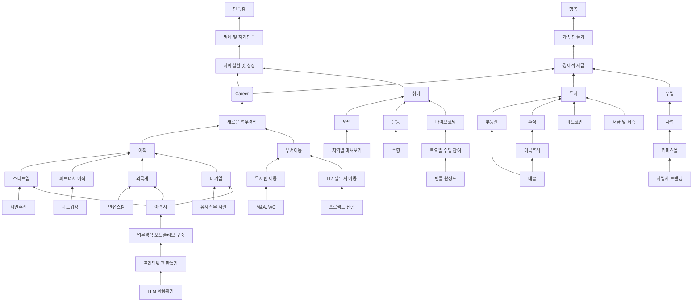

동근's Why Tree

---

### 석빈's Why Tree

```mermaid
graph BT
    Center(Career)

    Center --> WhySelf[자아실현 및 성장]
    Center --> WhyMoney[경제적 자립]

    Hobby[취미] --> WhySelf
    Wine[와인] --> Hobby
    RegionWine[지역별 마셔보기] --> Wine

    Exer[운동] --> Hobby
    Swim[수영] --> Exer

    VibeCoding[바이브코딩] --> Hobby
    SatClass[토요일 수업 참여] --> VibeCoding
    TeamProject[팀플 완성도] --> SatClass

    WhySelf --> Honor[명예 및 자기만족]
    Honor --> Sat[만족감]

    Invest[투자] --> WhyMoney
    SideJob[부업] --> WhyMoney
    
    RealEstate[부동산] --> Invest
    Loan[대출] --> RealEstate
    Loan --> USStock
    
    Stock[주식] --> Invest
    USStock[미국주식] --> Stock
    
    Bitcoin[비트코인] --> Invest
    
    Saving[저금 및 저축] --> Invest
    
    Biz[사업] --> SideJob
    Commerce[커머스몰] --> Biz
    Branding[사업체 브랜딩] --> Commerce

    WhyMoney --> Family[가족 만들기]
    Family --> Happy[행복]

    NewExp[새로운 업무경험] --> Center
    JobChange[이직] --> NewExp

    MoveDept[부서이동] --> NewExp
    InvestTeam[투자팀 이동] --> MoveDept
    MNA[M&A, V/C] --> InvestTeam
    ITDept[IT개발부서 이동] --> MoveDept
    ITProject[프로젝트 진행] --> ITDept

    StartUp[스타트업] --> JobChange
    Referral[지인추천] --> StartUp

    Partner[파트너사 이직] --> JobChange
    Networking[네트워킹] --> Partner

    Foreign[외국계] --> JobChange
    Interview[면접스킬] --> Foreign

    BigCorp[대기업] --> JobChange
    SimilarRole[유사직무 지원] --> BigCorp

    Resume[이력서] --> StartUp
    Resume --> Foreign
    Resume --> BigCorp

    Portfolio[업무경험 포트폴리오 구축] --> Resume
    Framework[프레임워크 만들기] --> Portfolio
    LLMHow[LLM 활용하기] --> Framework
```

---

### 석빈's Why Tree(테스트)

```mermaid
graph BT
    Center(Career)

    Center --> WhySelf[자아실현 및 성장]
    Center --> WhyMoney[경제적 자립]

    Hobby[취미] --> WhySelf
    Wine[와인] --> Hobby
    RegionWine[지역별 마셔보기] --> Wine

    Exer[운동] --> Hobby
    Swim[수영] --> Exer

    VibeCoding[바이브코딩] --> Hobby
    SatClass[토요일 수업 참여] --> VibeCoding
    TeamProject[팀플 완성도] --> SatClass

    WhySelf --> Honor[명예 및 자기만족]
    Honor --> Sat[만족감]

    Invest[투자] --> WhyMoney
    SideJob[부업] --> WhyMoney
    
    RealEstate[부동산] --> Invest
    Loan[대출] --> RealEstate
    Loan --> USStock
    
    Stock[주식] --> Invest
    USStock[미국주식] --> Stock
    
    Bitcoin[비트코인] --> Invest
    
    Saving[저금 및 저축] --> Invest
    
    Biz[사업] --> SideJob
    Commerce[커머스몰] --> Biz
    Branding[사업체 브랜딩] --> Commerce

    WhyMoney --> Family[가족 만들기]
    Family --> Happy[행복]

    NewExp[새로운 업무경험] --> Center
    JobChange[이직] --> NewExp

    MoveDept[부서이동] --> NewExp
    InvestTeam[투자팀 이동] --> MoveDept
    MNA[M&A, V/C] --> InvestTeam
    ITDept[IT개발부서 이동] --> MoveDept
    ITProject[프로젝트 진행] --> ITDept

    StartUp[스타트업] --> JobChange
    Referral[지인추천] --> StartUp

    Partner[파트너사 이직] --> JobChange
    Networking[네트워킹] --> Partner

    Foreign[외국계] --> JobChange
    Interview[면접스킬] --> Foreign

    BigCorp[대기업] --> JobChange
    SimilarRole[유사직무 지원] --> BigCorp

    Resume[이력서] --> StartUp
    Resume --> Foreign
    Resume --> BigCorp

    Portfolio[업무경험 포트폴리오 구축] --> Resume
    Framework[프레임워크 만들기] --> Portfolio
    LLMHow[LLM 활용하기] --> Framework
```
